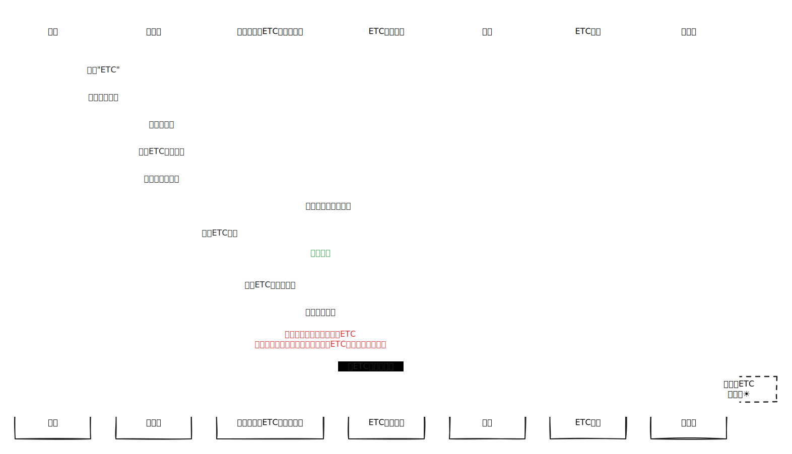
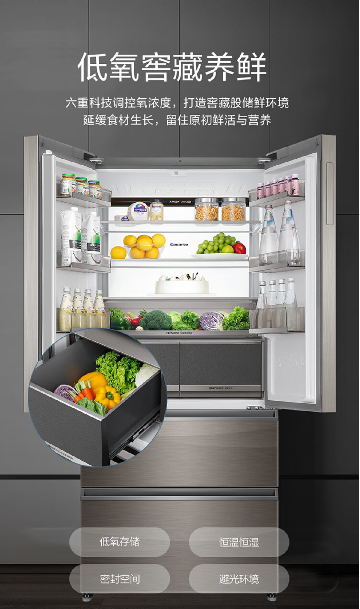

# Tesla

## 锁车音效



> 特斯拉U盘插入电脑，下载好的音源粘贴在<mark style="color:red;">根目录</mark>里，重命名为“LockChime.wav”

## 介绍



## 充电选择

| 品牌   | 优势  | 缺点 |
| ---- | --- | -- |
| 超充   | 快   |    |
| 特来电  | 停车费 |    |
| 星星充电 |     |    |
| 蔚来超充 |     |    |
| 国家电网 |     |    |
| 高德搜索 |     |    |

## ETC不要贴在玻璃上

太丑了。 所以别贴在玻璃上。 `less is more !`

## 能量回收制动受限

<figure><figcaption></figcaption></figure>

[解决办法](https://www.tesla.com/ownersmanual/modely/zh\_cn/GUID-3DFFB071-C0F6-474D-8A45-17BE1A006365.html)

> ### 能量回收制动 
>
> 电池温度较低或已充满电时，能量回收制动可能受限
>
> <mark style="background-color:orange;">要确保每次松开加速踏板时都获得相同的减速量</mark>，而不管电池状态如何.
>
> 您可以选择在能量回收制动受限时自动启用常规制动系统。
>
> 点击控制 > 踏板和转向 > 能量回收制动受限时实施制动。
>
>
>
> 启用能量回收制动受限时实施制动后，在实施制动时，制动踏板可能会移动，并在踩下时可能会<mark style="color:red;">比较费力</mark>。这是正常现象，不会影响您对 Model Y 减速。
>
>
>
> 由于 Model Y 使用能量回收制动，刹车片的使用频率通常低于传统制动系统中的制动片。为了避免锈蚀和腐蚀积聚，Tesla 建议<mark style="color:red;">经常踩下制动踏板，以应用机械制动器并使刹车片和刹车盘变干</mark>。

## 重启能解决99.9999%的问题

> ### [重新啟動觸控螢幕](https://www.tesla.com/ownersmanual/model3/zh\_tw\_us/GUID-518C51C1-E9AC-4A68-AE12-07F4FF8C881E.html#GUID-7462479C-A6D1-4F25-BF1B-4A3899BCA999) 
>
>
>
> **同時按住 方向盤 的滾動按鈕直到觸控螢幕變暗**
>
> 

* 网络连接, 比如`无法播放音乐`, `指令无法正常反馈`
* 点击屏幕没有响应

## 院士

[bo-ke.md](../books/bo-ke.md "mention")

